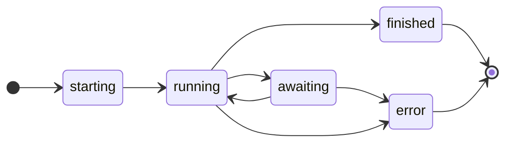

A flow launched with `Launch` response runs through the following states:



The `Launch` requires the following arguments:

* request (`fastAPI.Request`)
* entry_point (`str` or `callable`)
* inputs (`Any`)

**Example:**

The following example launches a CrewAI `Crew` in `hymn.app` with `core.Launch`.

```python
@app.enter(
        path="/", 
        model=hymn_model,
        summary="Hymn Creator",
        description="This agent creates a short hymn about a given topic of your choice using openai and crewai.",
        version="1.0.1",
        author="m.rau@house-of-communication.com",
        tags=["Test", "CrewAi"]
    )
async def enter(request: fastapi.Request, inputs: dict):
    topic = inputs.get("topic", "").strip()
    if not topic:
        raise core.InputsError(topic="Please give me a topic.")
    return core.Launch(request, "hymn.app:crew", inputs=inputs)
```

# Events

In the lifetime of a flow execution the following events are tracked.

| event  | description                               | method            | screen               |
| ------ | ----------------------------------------- | ----------------- | -------------------- |
| meta   | flow metadata and entry point information | (internal)        | n/a                  |
| inputs | user input data                           | (internal)        | Input                |
| agent  | agent information                         | agent meta data   | n/a                  |
| debug  | debug message                             | debug             | Log                  |
| stdout | stdout information                        | print, sys.stdout | Log                  |
| stderr | stderr information                        | sys.stderr        | Log                  |
| status | flow status change                        | (internal)        | n/a                  |
| error  | error information                         | (internal)        | Output/Reasoning/Log |
| action | action information                        | tool result       | Reasoning            |
| result | task result information                   | result            | Reasoning            |
| final  | final result information                  | final result      | Ouput                |
| upload | user file upload                          | (internal)        | Reasoning            |
| lock   | human intervention is required            | lock              | Output               |
| lease  | human input when locks are leased         | lease             | Log                  |

Kodosumi provides a couple of helper methods to simplify emitting events:

* `tracer.debug(message: str)` - emit debug plain text message
* `tracer.result(message: Any)` - emit result object
* `tracer.action(message: Any)` - emit action result object
* `tracer.markdown(message: str)` - emit markdown result string
* `tracer.html(message: str)` - emit HTML result string
* `tracer.text(message: str)` - emit plain text result string

The corresponding synchronous methods are

* `tracer.debug_sync(message: str)`
* `tracer.result_sync(message: Any)`
* `tracer.action_sync(message: Any)`
* `tracer.markdown_sync(message: str)`
* `tracer.html_sync(message: str)`
* `tracer.text_sync(message: str)`

## Payment Verification After Job Completion (Sokosumi Marketplace)

> **Warning — Known issue ([kodosumi#83](https://github.com/masumi-network/kodosumi/issues/83))**

When Kodosumi runs a flow as a Sokosumi marketplace job, it transitions the flow to `finished` as soon as `submit_result` returns 200 OK. This is a **fire-and-forget handoff** — Kodosumi does not poll for Masumi payment settlement afterward.

**What can go wrong:** The Masumi purchase can remain in `WaitingForManualAction` while Kodosumi already considers the job complete. When this happens, Sokosumi sends a "Job Failure Notification" email for a job that appears finished on the Kodosumi side.

### Diagnosing a stuck payment

Check the purchase status using the `blockchainIdentifier` for the job:

```
GET /api/v1/purchase?blockchainIdentifier={blockchainIdentifier}
Header: token: <MASUMI_API_KEY>
```

If the response shows `status: WaitingForManualAction`, use the error-state-recovery endpoint to unblock it.

### Manual recovery

```
# Step 1: Fetch current updatedAt (required for the optimistic lock — must be fresh)
GET /api/v1/purchase?blockchainIdentifier={blockchainIdentifier}
Header: token: <MASUMI_API_KEY>

# Step 2: Trigger recovery
POST /api/v1/purchase/error-state-recovery
Header: token: <MASUMI_API_KEY>
Body:
{
  "blockchainIdentifier": "<job identifier>",
  "network": "Mainnet",
  "updatedAt": "<updatedAt value from Step 1>"
}
```

On success, the purchase status moves to `WaitingForExternalAction` or `None` and the Masumi workers complete settlement automatically.

**Important:** `updatedAt` is an optimistic lock — always fetch it immediately before calling recovery. Stale values are rejected.

### Is it always a problem?

Not necessarily. The chain may be slow rather than stuck — payment notifications from Sokosumi can arrive before the chain fully settles. Monitor the purchase status 10–30 minutes after a failure notification before triggering manual recovery.
